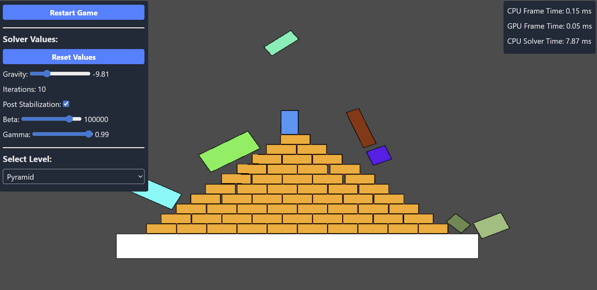

Web-AVB2D is a 2D implementation of the Augmented Vertex Block Descent [(AVBD)](https://graphics.cs.utah.edu/research/projects/avbd/) algorithm by Chris Gile, Elie Diaz and Cem Yuksel. 

It is implemented using the WebGPU API for rendering, and a typescript physics solver. I used vue for the frontend and interactivity with the solver.

I am planning on adding other constraint based forces and inequalities, and maybe more shapes than the simple box, that was easy to implement with box - box naive collision detection.